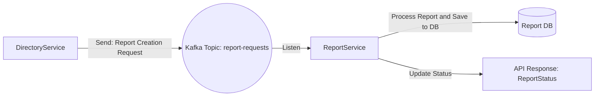

# BackendAssessment

This project is an example of a microservice architecture based on .NET 9. It consists of two main microservices:

- **DirectoryService**: Manages contact and communication information.
- **ReportService**: Processes reporting requests and works asynchronously over Kafka.

## Requirements

- [.NET 9 SDK](https://dotnet.microsoft.com/en-us/download/dotnet/9.0)
- Docker & Docker Compose

## Installation

```bash
git clone https://github.com/umutkonmus/BackendAssesment.git
cd BackendAssesment
docker-compose build
docker-compose up -d
```

## Services & API details


### 📘 DirectoryService

📍 Base URL: `http://localhost:5000`

### GET /api/person
#### Request Body

This request does not require a request body.

#### Response

-   `data` (array): An array of person objects, each containing the following information:
    
    -   `id` (string): The unique identifier of the person.
        
    -   `firstName` (string): The first name of the person.
        
    -   `lastName` (string): The last name of the person.
        
    -   `companyName` (string): The name of the company associated with the person.
        
-   `status` (integer): The status of the response.
    
-   `isSuccessful` (boolean): Indicates if the request was successful.
    
-   `message` (string): A message related to the response.
    
-   `errors` (array): An array of error messages, if any.
Tüm kişileri getirir.

**Yanıt:**
```json
{
	"data":  [
		{
			"id":  "7b9587ca-a82e-44f1-aadc-386effc640d9",
			"firstName":  "Umut",
			"lastName":  "Konmus",
			"companyName":  "Kocsistem"
		},
		{
			"id":  "d8f88afc-4990-4654-ac72-3dcee9a7062f",
			"firstName":  "Sultan",
			"lastName":  "Sancar",
			"companyName":  "Proje Istanbul"
		}
	],
	"status":  200,
	"isSuccessful":  true,
	"message":  null,
	"errors":  null
}
```

---

### POST /api/person

The `Add Person` endpoint allows you to create a new person with the provided details.

#### Request Body

-   `FirstName` (string): The first name of the person.
    
-   `LastName` (string): The last name of the person.
    
-   `CompanyName` (string): The company name of the person.
    

#### Response

Upon successful execution, the API returns a JSON object with the following fields:

-   `data` (object): An object containing the details of the newly created person, including `firstName`, `lastName`, and `companyName`.
    
-   `status` (integer): The status code of the response.
    
-   `isSuccessful` (boolean): Indicates whether the request was successful.
    
-   `message` (string): A message related to the response, if any.
    
-   `errors` (array): An array of errors, if any.
    
**Request:**
```json
{
	"FirstName":"Umut",
	"LastName":"Konmus",
	"CompanyName":"Kocsistem"
}
```

**Response:**
```json
{
	"data":  {
		"firstName":  "Sultan",
		"lastName":  "Sancar",
		"companyName":  "Proje Istanbul"
	},
	"status":  201,
	"isSuccessful":  true,
	"message":  null,
	"errors":  null
}
```

---
### GET /api/person/{id}

The endpoint makes an `HTTP GET` request to retrieve information about a specific person using their unique identifier.

#### Request Body

This request does not require a request body.

#### Response Body

The response will be in JSON format and will contain the following fields:

-   `data`: An object containing information about the person, including their ID, first name, last name, company name, and contact information.
    
    -   `id`: The unique identifier of the person.
        
    -   `firstName`: The first name of the person.
        
    -   `lastName`: The last name of the person.
        
    -   `companyName`: The name of the company associated with the person.
        
    -   `contactInfos`: An array of contact information objects, each containing an ID, type name, and value.
        
        -   `id`: The unique identifier of the contact information.
            
        -   `typeName`: The type of contact information (e.g., email, phone number).
            
        -   `value`: The contact information value (e.g., email address, phone number).
            
-   `status`: The status code of the response.
    
-   `isSuccessful`: A boolean indicating whether the request was successful.
    
-   `message`: A message associated with the response, if any.
    
-   `errors`: Any errors associated with the response, if any.

**Response**
```json
{
	"data":  {
		"id":  "7b9587ca-a82e-44f1-aadc-386effc640d9",
		"firstName":  "Umut",
		"lastName":  "Konmus",
		"companyName":  "Kocsistem",
		"contactInfos":  [
			{
				"id":  "2d9ca048-5621-4bfa-8813-5634d191c638",
				"typeName":  "location",
				"value":  "Istanbul"
			},
			{
				"id":  "46531b4d-881e-4c35-9c09-8acc4fbe4c70",
				"typeName":  "email",
				"value":  "umutkonmus@icloud.com"
			},
			{
				"id":  "5d94794e-c5fe-46d3-abde-2b32582f7a09",
				"typeName":  "phone",
				"value":  "5388155003"
			},
			{
				"id":  "f3f701b5-0671-4c44-8624-dc088bba3bf7",
				"typeName":  "email",
				"value":  "umutkonmus@gmail.com"
			}
		]
	},
	"status":  200,
	"isSuccessful":  true,
	"message":  null,
	"errors":  null
}
```

---

### POST /api/ContactInfo

This endpoint is used to create contact information for a person.

#### Request Body

-   PersonID (string, required): The ID of the person for whom the contact information is being added.
    
-   TypeID (string, required): The type of contact information being added.
    
-   Value (string, required): The actual contact information value.
    

#### Response Body

The response is in the form of a JSON schema:


-   `data (object)`: Contains the personID, typeID, and value of the contact information.
    
-   `status (number)`: The status code of the response.
    
-   `isSuccessful (boolean)`: Indicates if the request was successful.
    
-   `message (string)`: Any additional message related to the response.
    
-   `errors (array)`: Array of errors, if any, encountered during the request.

**Request**
```json
{
	"PersonID":"7b9587ca-a82e-44f1-aadc-386effc640d9",
	"TypeID":"88d24677-6eeb-4ce0-b4ab-49585f87374a",
	"Value":"5388155003"
}
```

**Response**
```json
{
	"data":  {
		"personID":  "7b9587ca-a82e-44f1-aadc-386effc640d9",
		"typeID":  "88d24677-6eeb-4ce0-b4ab-49585f87374a",
		"value":  "5388155003"
	},
	"status":  201,
	"isSuccessful":  true,
	"message":  null,
	"errors":  null
}
```

---
### DELETE /api/ContactInfo/{id}

The API makes an HTTP DELETE request to delete the contact information with the specified ID. Upon successful execution, the response will be in the form of a JSON schema as follows:

-   `data (object)`: false (if success)
    
-   `status (number)`: The status code of the response.
    
-   `isSuccessful (boolean)`: Indicates if the request was successful.
    
-   `message (string)`: Any additional message related to the response.
    
-   `errors (array)`: Array of errors, if any, encountered during the request.

**Response**
```json
{
	"data":  false,
	"status":  200,
	"isSuccessful":  true,
	"message":  null,
	"errors":  null
}
```
---
### POST /api/ContactType

This endpoint allows you to add a new contact type.

#### Request Body

-   `name` (string, required): The name of the contact type to be added.
    

#### Response
-   `data (object)`: Contains the name of the contact type information.
    
-   `status (number)`: The status code of the response.
    
-   `isSuccessful (boolean)`: Indicates if the request was successful.
    
-   `message (string)`: Any additional message related to the response.
    
-   `errors (array)`: Array of errors, if any, encountered during the request.


**Request**
```json
{
	"name":"test"
}
```
**Response**
```json
{
	"data":  {
		"name":  "test"
	},
	"status":  201,
	"isSuccessful":  true,
	"message":  null,
	"errors":  null
}
```
---
### GET /api/ContactType

This endpoint retrieves a list of contact types.

#### Request

No request body is required for this endpoint.

#### Response

The response will be a JSON object with the following schema:

-   `data` (array): An array of contact type objects, each containing an `id` and a `name`.
    
-   `status` (number): The status of the response.
    
-   `isSuccessful` (boolean): Indicates whether the request was successful.
    
-   `message` (string): A message related to the response, if any.
    
-   `errors` (array): An array of errors, if any.

JSON

```json
{
	"data":  [
		{
			"id":  "",
			"name":  ""
		}
	],
	"status":  0,
	"isSuccessful":  true,
	"message":  null,
	"errors":  null
}
```
---
### DELETE /api/person/{id}

The API makes an HTTP DELETE request to delete the person with the specified ID. Upon successful execution, the response will be in the form of a JSON schema as follows:

-   `data (object)`: false (if success)
    
-   `status (number)`: The status code of the response.
    
-   `isSuccessful (boolean)`: Indicates if the request was successful.
    
-   `message (string)`: Any additional message related to the response.
    
-   `errors (array)`: Array of errors, if any, encountered during the request.

**Response**
```json
{
	"data":  false,
	"status":  200,
	"isSuccessful":  true,
	"message":  null,
	"errors":  null
}
```
---
### POST /api/reports

This endpoint allows you to create a new report.

#### Request Body

-   Location: (text) The location for the report.
    

Example:

JSON

```json
{
	"Location":"Istanbul"
}
```

#### Response

-   Status: 200
    
-   Content-Type: text/plain
    

Example:

```
Report request sent.
```

---

### 📗 ReportService

📍 Base URL: `http://localhost:5001`


### GET /api/report

This endpoint retrieves a report.

#### Request Body

This request does not require a request body.

#### Response Body

The response is in JSON format and has the following schema:

JSON

The `data` array contains objects with `id`, `requestedAt`, and `status` fields. The `status` field indicates the status of the report. The `status`, `isSuccessful`, `message`, and `errors` fields provide additional information about the response.

```json
{
	"data":  [
		{
			"id":  "3580b387-f361-4984-8c0f-b753cf0c0b01",
			"requestedAt":  "2025-04-13T20:18:41.834583",
			"status":  "Completed"
		}
	],
	"status":  200,
	"isSuccessful":  true,
	"message":  null,
	"errors":  null
}
```

### GET /api/report/{id}

This endpoint makes an HTTP GET request to retrieve the report details for a specific report ID.

#### Request

This request does not require a request body.


#### Response

The response is in JSON format and has the following schema:

-   `data` (object): Contains the details of the report.
    
    -   `id` (string): The ID of the report.
        
    -   `requestedAt` (string): The timestamp when the report was requested.
        
    -   `status` (string): The status of the report.
        
    -   `reportDetails` (array): Details of the report, including:
        
        -   `id` (string): The ID of the report detail.
            
        -   `location` (string): The location associated with the report detail.
            
        -   `personCount` (number): The count of persons related to the report detail.
            
        -   `phoneNumberCount` (number): The count of phone numbers related to the report detail.
            
-   `status` (number): The status code of the response.
    
-   `isSuccessful` (boolean): Indicates if the request was successful.
    
-   `message` (string): A message related to the response.
    
-   `errors` (array): An array of errors, if any.

JSON

```json
{
	"data":  {
		"id":  "3580b387-f361-4984-8c0f-b753cf0c0b01",
		"requestedAt":  "2025-04-13T20:18:41.834583",
		"status":  "Completed",
		"reportDetails":  [
			{
				"id":  "18211c22-4c55-4e12-86da-165ddac96b83",
				"location":  "Istanbul",
				"personCount":  2,
				"phoneNumberCount":  1
			}
		]
	},
	"status":  200,
	"isSuccessful":  true,
	"message":  null,
	"errors":  null
}
```

The response contains the report details including the report ID, requested timestamp, status, and report details such as location, person count, and phone number count. The "status" field indicates the status of the request, and the "isSuccessful" field specifies if the request was successful.

---

## Tests

```bash
dotnet test DirectoryService.Tests
dotnet test ReportService.Tests
```


## Kafka Communication Diagram
